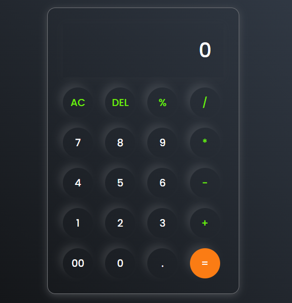

# 🧮 Cal-C (Simple JavaScript Calculator)

**Cal-C** is a sleek, modern calculator built using HTML, CSS, and JavaScript. It's designed to be minimal, clean, and user-friendly — perfect for basic arithmetic operations.

 <!-- You can add a screenshot and name it preview.png -->

---

## 🚀 Features

- Responsive calculator UI with neumorphic design
- Supports basic arithmetic: `+`, `-`, `*`, `/`, `%`
- Special functions: `AC` (All Clear), `DEL` (Backspace), `=`
- Styled using custom Google Fonts and CSS shadows for a glassy look
- Real-time display update as buttons are pressed

---

## 🛠️ Tech Stack

- **HTML5**
- **CSS3**
- **Vanilla JavaScript (ES6)**

---

---

## 📦 How to Run

1. Clone or download the repository.
2. Open the `index.html` file in your browser.
3. Start calculating!

---

## 🔒 Disclaimer

> This calculator uses `eval()` to compute expressions. While fine for this controlled context, be cautious using `eval()` in production applications due to potential security risks.

---

## 🙌 Author

Made with 💻 by Anant Tirupati

Feel free to fork and customize!

